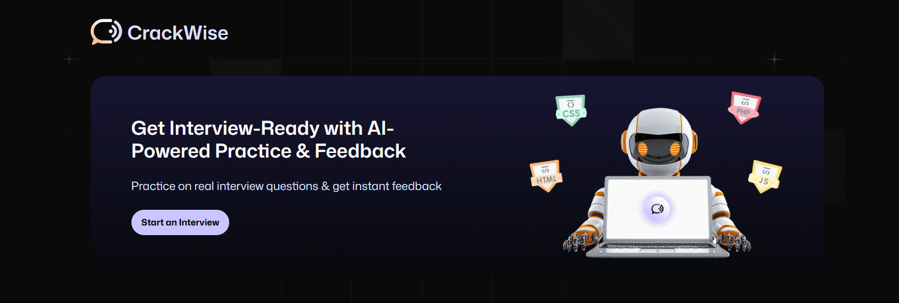
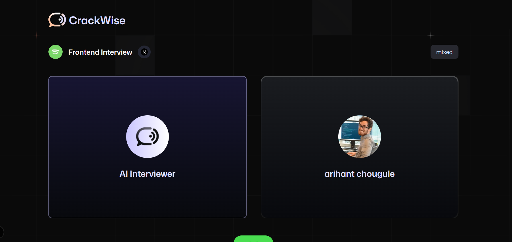

# AI Voice Agent for Interview - Next.js




## Live Website

Access the live version of the AI Voice Agent here: [https://your-live-website-url.com](https://your-live-website-url.com)

## Project Description

This project is an AI-powered voice agent designed to assist users in interview preparation. Built with Next.js, it leverages OpenAI's API, Supabase for backend services, and VAPID keys for push notifications. The agent interacts with users through voice commands and provides intelligent responses to simulate interview scenarios.

## How It Works

1. Home Page
   Users are greeted with a call-to-action to start an interview.
   Clicking "Start an Interview" redirects to the interview page with a toast notification.
2. Interview Page
   Users can interact with the AI interviewer.
   The Call button starts the interview, and the End button ends the session with feedback generation.
3. Feedback Page
   Displays detailed feedback on the user's performance.
   Includes strengths, areas for improvement, and an overall score.
   Users can navigate back to the dashboard or retake the interview.
4. Dashboard
   Users can view past interviews and upcoming interviews.
   Each interview card includes options to view feedback or retake the interview.

## Features

- AI-powered interview practice.
- Real-time feedback on interview performance.
- User authentication and session management.
- Responsive design for all devices.
- Toast notifications for user interactions.
- Dashboard to view past and upcoming interviews.

## Folder Structure

```
ai-agent-for-interview/
├── app/                   # Next.js app directory with pages and components
│   └── (root)/page.tsx    # Main entry page
├── Components/            # React components including Agent.tsx
├── lib/                   # Library files such as vap.sdk.ts
├── public/                # Public assets like images
├── styles/                # CSS and styling files
├── README.md              # Project documentation
├── package.json           # Project dependencies and scripts
└── .env                   # Environment variables file (not committed)
```

## Technologies Used

- Frontend: React, Next.js, Tailwind CSS
- Backend: Firebase Authentication, VAPI SDK
- Toast Notifications: sonner
- Hosting: Vercel (or any other platform)

## Prerequisites

- Node.js (v16 or higher recommended)
- npm or yarn package manager
- An OpenAI API key
- Supabase project with API keys
- VAPID keys for push notifications

## Installation

1. Clone the repository:

```bash
git clone crackwise
cd AI-Voice-Agent-for-Interview-Nextjs/ai-agent-for-interview
```

2. Install dependencies:

```bash
npm install
# or
yarn install
```

## Environment Variables (.env)

Create a `.env` file in the `ai-agent-for-interview` directory with the following variables:

```env
NEXT_PUBLIC_OPENAI_API_KEY=your_openai_api_key_here
OPENAI_API_KEY=your_openai_api_key_here
NEXT_PUBLIC_VAPID_PUBLIC_KEY=your_vapid_public_key_here
VITE_VAPID_PUBLIC_KEY=your_vapid_public_key_here
NEXT_PUBLIC_SUPABASE_URL=your_supabase_url_here
NEXT_PUBLIC_SUPABASE_ANON_KEY=your_supabase_anon_key_here
SUPABASE_URL=your_supabase_url_here
SUPABASE_ANON_KEY=your_supabase_anon_key_here
SUPABASE_SERVICE_ROLE_KEY=your_supabase_service_role_key_here
```

> **Note:** Replace the placeholder values with your actual keys. Keep this file secure and do not commit it to version control.

## Running the Project

Start the development server:

```bash
npm run dev
# or
yarn dev
```

Open your browser and navigate to [http://localhost:3000](http://localhost:3000) to interact with the AI Voice Agent.

## Deployment

You can deploy this Next.js app easily on platforms like Vercel. Refer to the [Next.js deployment documentation](https://nextjs.org/docs/app/building-your-application/deploying) for detailed instructions.

## Contribution

Contributions are welcome! Please follow these steps to contribute:

1. Fork the repository
2. Create a new branch (`git checkout -b feature/your-feature-name`)
3. Make your changes and commit (`git commit -m 'Add some feature'`)
4. Push to the branch (`git push origin feature/your-feature-name`)
5. Open a pull request

Please ensure your code follows the existing style and includes appropriate tests.

## License

This project is licensed under the MIT License. See the [LICENSE](LICENSE) file for details.

## Learn More

- [Next.js Documentation](https://nextjs.org/docs)
- [OpenAI API Documentation](https://platform.openai.com/docs/)
- [Supabase Documentation](https://supabase.com/docs)
- [VAPID Keys and Push Notifications](https://developers.google.com/web/fundamentals/push-notifications/web-push-protocol)

---

This README provides a comprehensive overview to get started with the AI Voice Agent for Interview project. For any questions or contributions, feel free to open an issue or pull request.
